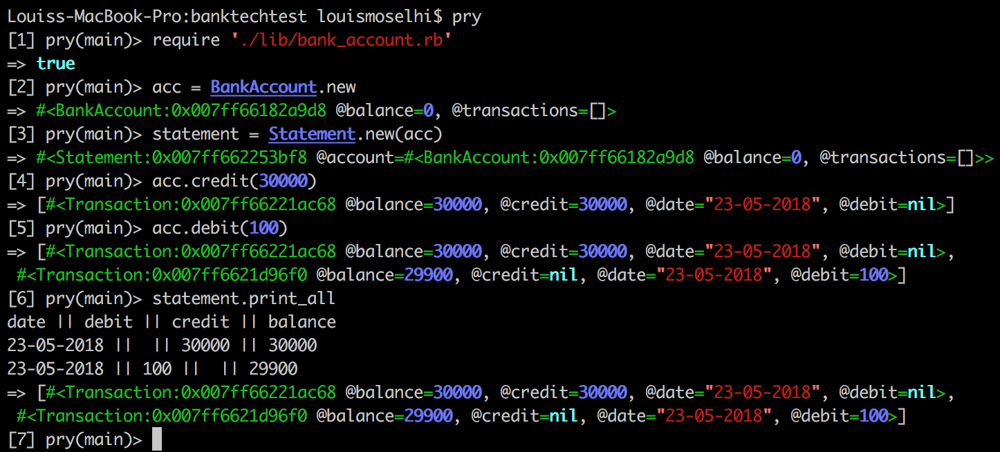

# banktechtest

## Setup

Install ruby, bundler, pry

Clone this repo and cd into it

Run bundle install

## Usage

## Testing

Run rspec

## My Approach

I wanted a TDD app with separation of concerns. I started with the BankAccount class, with the balance and credit and debit functions. I then created the Transaction class to hold the values of the debits and credits. I created a transactions array in the BankAccount to hold these, with each transaction being pushed into the array. I then added the statement class, which iterates over the transactions array and prints each one to the terminal.
